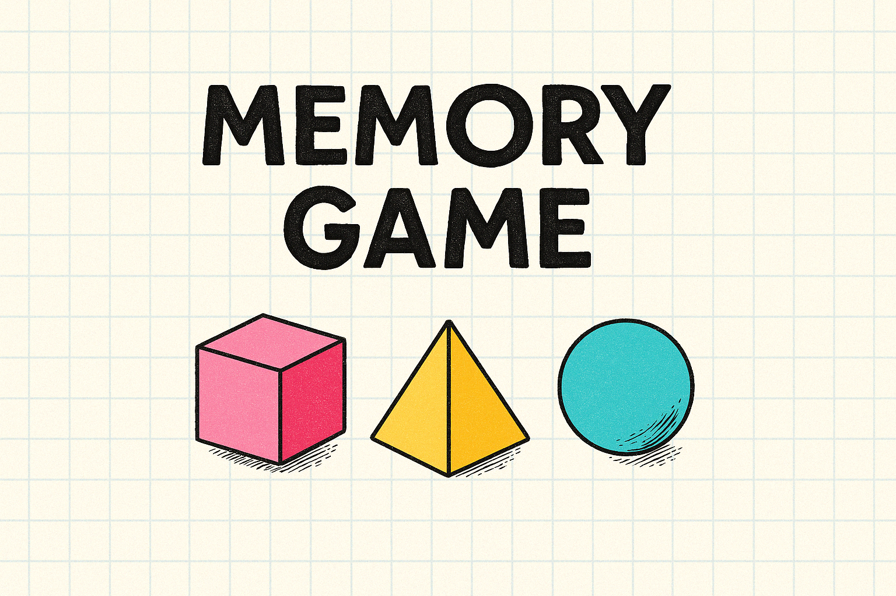

<p align="center">
  
</p>

# 🧠 Memory Game

Bienvenido/a a **Memory Game**, un juego de cartas interactivo inspirado en figuras geométricas en 3D. Diseñado con una estética nostálgica de cuaderno cuadriculado, animaciones suaves y un entorno responsive. Ideal para entrenar la memoria y disfrutar de una experiencia visual única.

---

## 🎮 Demo

🔗 [Juega aquí](https://memory-game-htn9.onrender.com/)  

---

## 📁 Estructura del proyecto

```
/
├── index.html              # Página de bienvenida
├── memory_game.html        # Pantalla del juego
├── css/
│   └── styles.css          # Estilos globales y por secciones
│   └── media_queries.css   # Media queries para tablet y desktop
│   └── keyframes.css       # Animaciones
├── js/
│   ├── functions.js        # Utilidades comunes y efectos visuales
│   └── memory-game.js      # Lógica del juego
├── img/                    # Figuras geométricas (cubo, tetraedro, etc.)
└── README.md
```

---

## 🧩 Características

- Diseño responsive con grid dinámico basado en el viewport
- Animaciones CSS y efectos interactivos en cartas
- Modo de juego con vidas, detección de victoria/derrota
- Efecto máquina de escribir, cubo 3D rotatorio
- Mensajes dinámicos con efectos visuales personalizados
- Footer dinámico con autoría

---

## ⚙️ Tecnologías utilizadas

- HTML5
- CSS3 (incluye `dvh`, animaciones, isometría)
- JavaScript (DOM, lógica de juego, modularidad)
- Render.com (despliegue)

---


## ✍️ Autoría

Diseño y desarrollo por **Yoanna Rodionova**  
💌 Powered by creatividad, lógica y un toque de nostalgia digital.

---

## 🪄 Próximas mejoras

- Animación en el mensaje dinámico
- Sistema de puntuación
- Temporizador
- Sonido al voltear cartas
- Selector de dificultad


---
